# Epic #49: Project Visualization

Visual representations of the Epic #49 architecture and timeline using Mermaid diagrams.

---

## 1. Project Timeline (Gantt Chart)

---

## 2. Phase Dependencies & Blocking

---

## 3. Module Architecture

---

## 4. Development Process Workflow

---

## 5. Test Coverage Requirements by Module

---

## 6. MCP Servers Configuration

---

## 7. Issue Distribution by Phase

---

## 8. Git Submodule Structure (Phase 2+)

---

## 9. Success Path to Production

```mermaid
graph TD
    Phase1["Phase 1: Extraction<br/>Feb 3 Target"]
    Phase1 --> P1_Success{Phase 1<br/>Success?}
    P1_Success -->|No| P1_Fix["Fix Issues<br/>Re-test"]
    P1_Fix --> Phase1
    P1_Success -->|Yes| Phase1_Gate["✓ Gate Passed<br/>85%+ Coverage<br/>Zero ESLint<br/>All Tests Pass"]
    
    Phase1_Gate --> Phase2["Phase 2: Submodules<br/>Feb 6 Target"]
    Phase2 --> P2_Success{Phase 2<br/>Success?}
    P2_Success -->|No| P2_Fix["Fix Issues<br/>Verify Structure"]
    P2_Fix --> Phase2
    P2_Success -->|Yes| Phase2_Gate["✓ Gate Passed<br/>Submodules Created<br/>Docker Works"]
    
    Phase2_Gate --> Phase3["Phase 3: Integration & CI/CD<br/>Feb 20 Target"]
    Phase3 --> P3_Success{Phase 3<br/>Success?}
    P3_Success -->|No| P3_Fix["Fix Issues<br/>Improve Coverage"]
    P3_Fix --> Phase3
    P3_Success -->|Yes| Phase3_Gate["✓ Gate Passed<br/>3000+ Tests<br/>Full CI/CD<br/>Production Ready"]
    
    Phase3_Gate --> Phase4["Phase 4: Full Separation<br/>Future"]
    Phase4 --> Production["🎉 Production<br/>Independent Repos<br/>npm Packages"]
    
    style Phase1 fill:#90EE90
    style Phase2 fill:#FFB6C6
    style Phase3 fill:#87CEEB
    style Phase4 fill:#DDA0DD
    style Production fill:#FFD700
```

---

## 10. Development Standards Matrix

---

## Legend

### Colors Used

| Color | Meaning |
|-------|---------|
| 🟢 Light Green | Core/Utils - Backend Components |
| 🔵 Light Blue | Dashboard - Frontend Component |
| 🟣 Light Purple | Utils/Services - Shared Library |
| 🟠 Light Orange | Documentation/Strategy |
| 🟥 Light Red | Blocking/Critical Path |
| 🟡 Gold | Success/Completion |
| ⚪ Gray | Start/End/Support |

### Timeline

- **Phase 1**: 6-9 days (Jan 20 - Feb 3, 2026)
- **Phase 2**: 2-3 days (Feb 3 - Feb 6, 2026) [Blocked by Phase 1]
- **Phase 3**: 11-16 days (Feb 6 - Feb 20, 2026) [Blocked by Phase 2]
- **Phase 4**: 3-5 days (TBD after Feb 20) [Blocked by Phase 3]

---

## Integration Notes

All diagrams use **Mermaid syntax** and are compatible with:
- GitHub README rendering
- GitBook documentation
- Markdown processors
- VS Code with Markdown Preview

To view these diagrams:
1. Open in GitHub directly (auto-renders)
2. Use VS Code Markdown Preview
3. Copy into Mermaid Live Editor (mermaid.live)

---

**Last Updated**: January 20, 2026  
**Version**: 1.0  
**Repository**: github.com/Rarsus/verabot2.0
